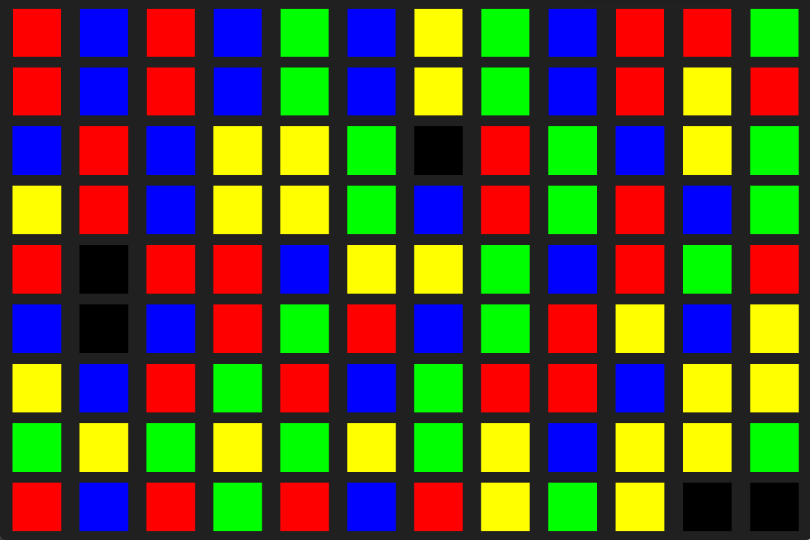

# crush3p
Myg Projet - Pour notre jeu candy crush en Pharo

## Auteurs
Oysiss : Simon Lagneau  
3xtasio : Paul Vanhee  
Trevor Bruniaux (pas présent dans la liste des contributeurs, on ne sait pas pourquoi)  

## Instructions d'installation
Dans un Playground lancez ce bloc de code :
```
Metacello new
    baseline: 'Bloc';
    repository: 'github://pharo-graphics/Bloc:05e5b0e385811719537f8cd89966b150a07be985/src';
    onConflictUseIncoming;
    load;
    lock.

Metacello new
    repository: 'github://Ducasse/Myg:v1.0.0';
    baseline: 'Myg';
    onConflictUseIncoming;
    load.
```
Ensuite, 
- Dans Browse > Git Repositories Browser (Ctrl+O+I) cliquez sur Add.
- Cliquez sur Clone from github.com puis renseignez :  
    - Owner name : 3xtasio  
Project name : crush3p  
Protocol : HTTPS  
- Le projet crush3p devrait maintenant être présent dans vos Repositories, double click dessus. Les packages apparaissent, click droit > Load sur chaque package pour les charger.



## Instructions d'utilisation

Pour lancer notre projet, dans un Playground lancez ce bloc de code : 
```
Crush3P open.
```
Cliquez sur Play, vous pouvez maintenant jouer.  

Le but est de faire des alignements de 3 blocs de même couleur, vous pouvez déplacer un bloc en cliquant dessus, avec un bloc adjacent en cliquant 2 fois dessus (problème que nous avons rencontrés avec la partie graphique que nous n'avons pas réussi à résoudre).

## Décisions de conception

- Nous avons décidé de nous partager les tâches afin d'être le plus efficace possible. Trévor et Simon se sont concentrés sur la partie logique et Paul sur la partie graphique.

- Nous avons fait hériter Block de MygAbstractBox afin de récupérer des comportements de celui-ci. Néanmoins, au vu de la façon dont nous gérons notre grille de jeu, nous avons inversé le fonctionnement de la position x et y d'un bloc de MygAbstractBox (la position x de MygAbstractBox est la position y de notre Block).

- Nous avons testé un peu plus la partie de détection des combos, verticalement et horizontalement, ainsi que les échanges de blocs, car c'est le cœur du fonctionnement de notre jeu.  
Néanmoins, certains points n'ont pas pu être testés. Par exemple, lorsqu'un combo est fait, les blocs disparaissent et laissent place à de nouveaux blocs, mais de nouveaux combos peuvent survenir dans cette manipulation. Il nous est impossible de prévoir ce comportement et donc de le tester.

- Nous avons évité au maximum de faire de grosses méthodes qui font trop de choses et qui ne sont pas compréhensibles. Pour ce faire, nous avons privilégié de petites méthodes qui ont chacune leurs utilités.

- La façon dont nous avons construit notre hiérarchie d'héritage pour Block nous permet d'utiliser côté UI le polymorphisme dans la méthode select de BlockElement.
Cela nous a également permis de rendre un GroundBlock impossible à bouger sans utilisation de conditions pour vérifier la classe d'un Block.  
Nous avons essayé d'avoir un code qui soit extensible/refactorable facilement.

- Pour la partie graphique, nous avons d'abord commencé par analyser la partie visuelle des projets existants (Sokoban, Takuzu..).
A partir de ça, nous avons su tirer les éléments principaux de conception.
Le menu principal se base sur des éléments de Bloc.

- Pour la création du plateau de jeu (BoardElement), nous avons créé l'objet visuel à partir d'un Board.
Un "Block" a une version visuelle "BlockElement".
Tous les blocs de couleurs ont leur représentation visuelle.
